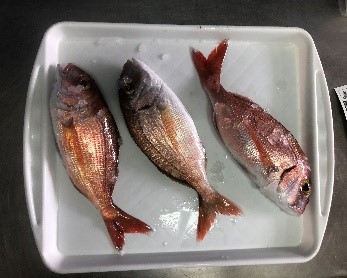
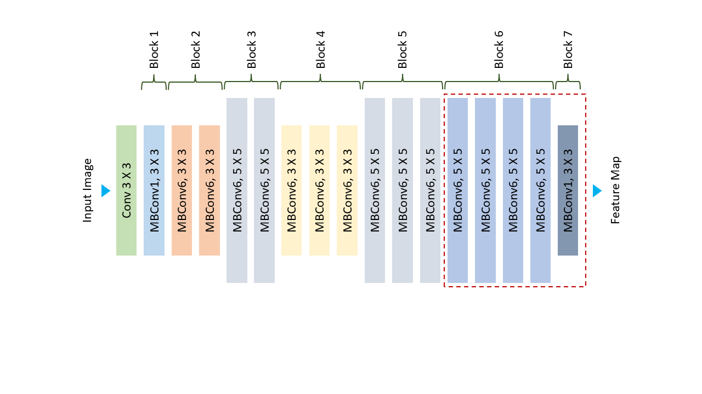
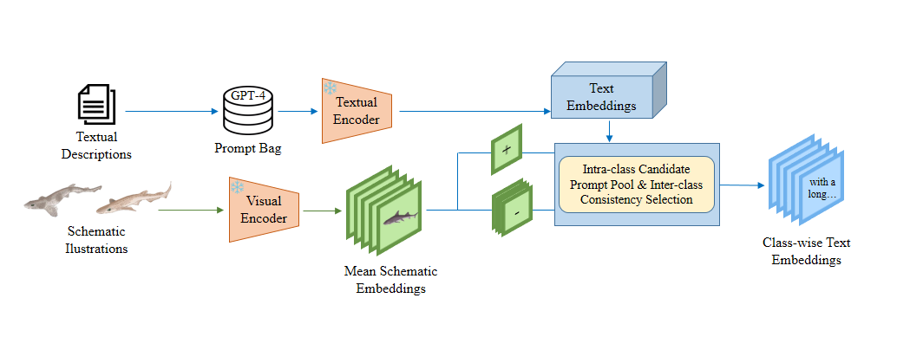
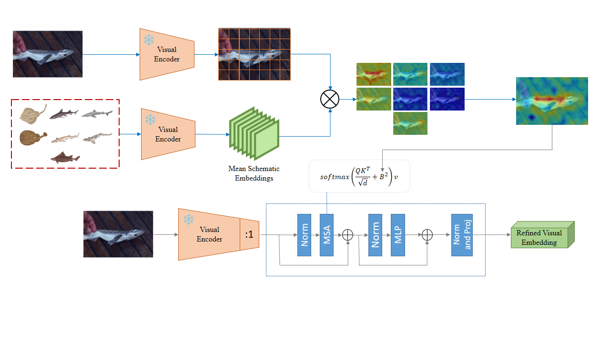
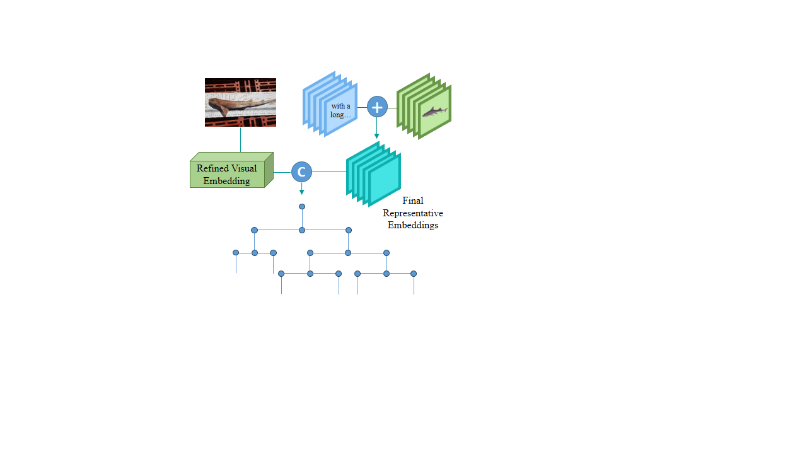
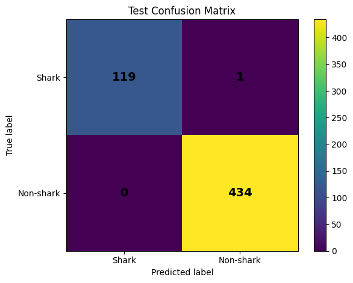

# 🧠 🦈 eLasmobranc Model – Taxonomical Identification 

First of all, an example execution hosted on Google Colab is presented, illustrating a practical reference for reproducing the results in an interactive cloud-based environment:

  

This project develops an automatic image-based system for elasmobranch identification using deep learning, addressing the challenges of limited labeled data and high morphological similarity between related species. The approach is structured around two complementary components:

- **Elasmobranch detection model**: distinguishes sharks and rays from other objects present in the images.
- **Hierarchical taxonomic classification model**: performs progressive identification (animal type, order, family and species) by incorporating domain-specific prior knowledge to improve fine-grained recognition under data-scarce conditions.

## Elasmobranch detection model

A dedicated dataset was constructed to frame the problem as a binary classification task, where one class corresponds to elasmobranch species and the other represents all remaining objects, including random items, other marine animals and visually similar scenes without elasmobranchs:

  
  
  

The detection model is based on a convolutional neural network with a pretrained EfficientNet-B0 backbone using transfer learning. Fine-tuning is applied to adapt the learned representations to the target domain by retraining the two final network blocks and replacing the output layer with one specifically designed for the problem. The proposed detection model achieves near-perfect performance on the test set, demonstrating its effectiveness for binary elasmobranch recognition. 

  

## Hierarchical taxonomic classification model

The taxonomic classification model addresses a seven-species multiclass problem using exclusively the eLasmobranc Dataset. This task is challenged by limited samples per class and high morphological and semantic similarity between related species, motivating a zero-shot informed approach based on CLIP. Prior knowledge is incorporated to enhance visual embeddings (by emphasizing discriminative traits), textual embeddings (by semantically defining species) and the classification process itself, improving fine-grained recognition under data-scarce conditions. The model is structured around three main components:

- Prompt extraction and validation: expert descriptions and automatically generated variants are filtered by measuring similarity against visual prototypes derived from schematic illustrations.

  

- Prototype-guided attention: schematic illustrations guide CLIP’s visual encoder to focus on distinctive and shared morphological features across taxonomic levels.

  

- Taxonomy-aware classification: predictions are obtained by aligning image embeddings with text prompts and visual prototypes, enabling hierarchical zero-shot species identification.
  

  

## Classification Performance

### 1️⃣ Elasmobranch Detection Model (Binary Classification)

The binary detection model achieves near-perfect performance on the test set, demonstrating its robustness in distinguishing elasmobranchs from non-target objects under real-world variability. These strong results are critical, as this model serves as the entry point of the pipeline and directly conditions the performance of the subsequent taxonomic classification stage.

<table align="center">
<tr>

<td align="center">
 
<b>🧩 Confusion Matrix</b>
</td>

<td align="center">
<b>📊 Classification Performance</b>  

<table>
<tr>
<th>Accuracy</th>
<th>Precision</th>
<th>Recall</th>
<th>F1-score</th>
</tr>
<tr>
<td>0.998</td>
<td>0.998</td>
<td>1.000</td>
<td>0.999</td>
</tr>
</table>

</td>

</tr>
</table>
